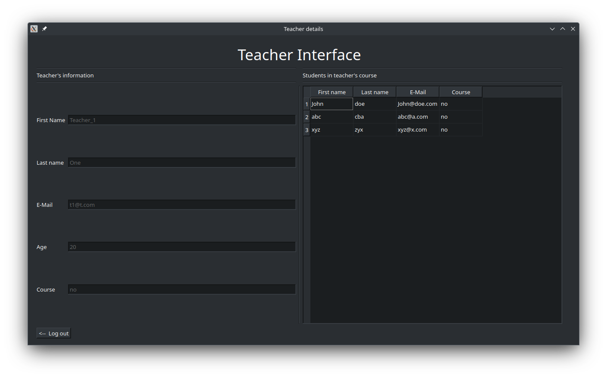

# Project Description 
This project is a simple school management system that uses QT framework as a GUI. The system provides different interfaces for three types of users (Admin, Student, Teacher). Each user has different authority for viewing and editing data across the system. Currently, the data is stored in an in-memory database (`QSql`) The following are the functionalities of the three type of users (some features may be missing in the current state)  

### Student Functionalities:
1. Register to one course
2. View its own profile

### Teacher Functionalities:
1. View its own profile
2. View assigned students

### Admin Functionalities:
1. Add new students
2. Add new teachers
3. Add new subjects
4. Remove any student/teacher
5. Modify any student/teach
6. Add new students
7. Add new teachers
8. Add new subjects
9. Remove any student/teacher
10. Modify any student/teach

# How to run
1- Run QT creator.

2- Load the project using the included `CMakeLists.txt` File.

3- Build and run the project from the IDE.

4- Login as an admin using the E-mail and password: "`admin`".

5- (Optional) Sign out and sign in again using different credentials, You can find them in the model file "`model.cpp`".

# Screenshots
Screenshot of the teacher interface:

# Disclaimer
This is just a hobby project designed with no intention for usage in a real world environment. 